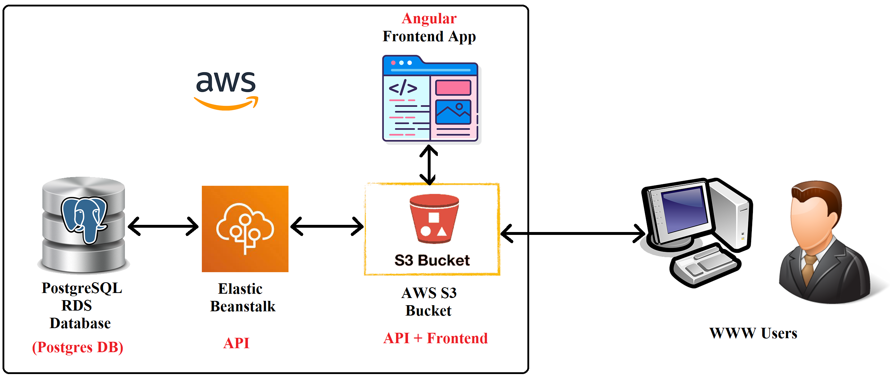

# Udagram Infrastructure

## Description:

Udagram Application is hosted on AWS servers, I've used the following services:
  1) RDS to host my PostgreSQL Database.
  2) Elastic Beanstalk to host my API application
  3) S3 Bucket to host both of the Frontend static files and the API files (indirectly via Elastic Beanstalk).
  4) IAM to create admin user to get credentials for CLI commands.

## Supporting tools:

To finalize this project, I used two extra tools:
* GitHub: A versioning service and once it gets new code in its main branch it automatically triggers the next step
* CircleCi: A pipeline automation server that is used to do the following actions
    1) install core services 
    2) install frontend / backend dependencies
    3) build frontend / backend
    4) Test frontend / backend
    5) If all of the above steps passed it deploy both frontend / backend to AWS
    6) If one step at least failed it stops and sends an email with the issue to be further inspected
