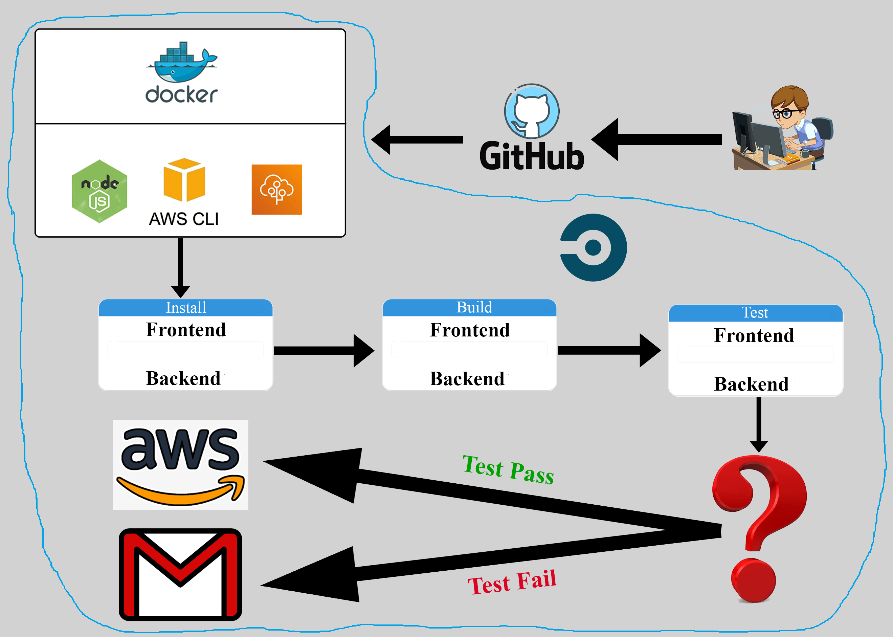

# Pipeline

Pipeline is the automation process of install, build, test and deploy process, as the following figure illustrates:

 

 As the figure illustrates, the pipeline works with the following sequence:

 * The developer writes his code and then commits to GitHub main branch

 * GitHub does its standard actions of storing and versioning then triggers action to CircleCi

 * Once CircleCi is triggered it starts the following actions
    
    1) Setup a docker image with all required services 
    2) Install the dependances (for both frontend and backend)
    3) Build the project (for both frontend and backend)
    4) Test the project (for both frontend and backend)
    5) If all of the above passed, it deploys the project to AWS (for both frontend and backend)
    6) If any of the above steps failed, it stops and send an email with the bad news
